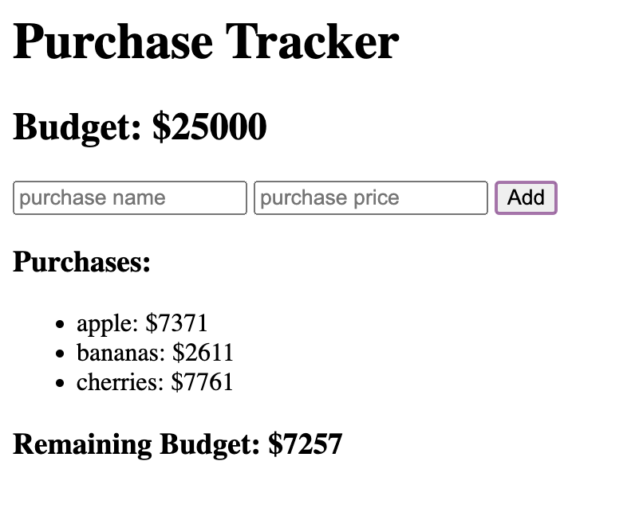

# Purchase tracker
## A purchase tracker with a specific budget amount. Each time an item is purchased it will subtract and update the budget amount; and display the purchase(s) description and amount spent on item. 

### DEPLOYED LINK: https://xaihang.github.io/purchase-tracker/
### SCREENSHOT Image of application: 

#### Practicing jQuery by building a simple budget/purchase tracker